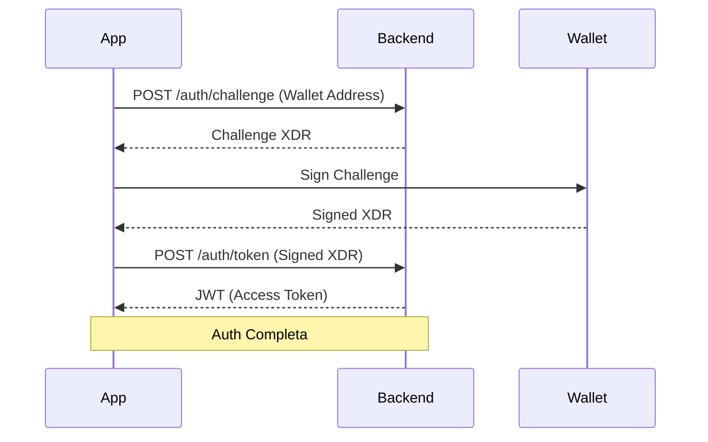

# Micopay — Plan de Conexión y Despliegue

Este plan detalla cómo unir el diseño de Stitch UI con el backend y el contrato de Soroban.

## 1. Capa de Comunicación (Frontend)

Para que el frontend sea limpio, crearemos dos archivos de "servicios":

- **`src/services/api.ts`**: Centraliza todas las llamadas al backend (Auth, Trades, Users). Usará **Axios** con un interceptor para inyectar el JWT automáticamente.
- **`src/services/stellar.ts`**: Encapsula la lógica de Soroban (construcción de XDRs, invocación del contrato `EscrowFactory`). Usará el **Stellar SDK**.

### Flujo de Datos


## 2. Estrategia de Despliegue (MVP)

### Backend & DB
- **Framework**: Fastify (Node.js).
- **Hosting**: **Render.com** o **Vercel** (ambos tienen capas gratuitas excelentes para MVPs).
- **Base de Datos**: **Neon.tech** (PostgreSQL Serverless), ideal por su rapidez de setup.

### Frontend
- **Web**: **Vercel** (despliegue automático desde GitHub).
- **Mobile (Test)**: **Capacitor + Android Studio/Xcode** para verlo en tu propio teléfono.

### Red de Stellar
- **Network**: **Testnet**. Usaremos el Friendbot para fondear las cuentas de prueba iniciales.

## 3. Próximos Pasos Técnicos

1.  **Instalar dependencias clave**:
    ```bash
    npm install @stellar/stellar-sdk axios @stellar/wallet-adapter-kit
    ```
2.  **Configurar Variables de Entorno**: Crear un `.env` en el frontend con la `BACKEND_URL` y el `ESCROW_CONTRACT_ID`.
3.  **Implementar el "Login con Wallet"**: Es el primer paso crítico para que el usuario pueda operar.

---
**¿Quieres que empecemos a crear estos archivos de conexión (`api.ts` y `stellar.ts`) para que ya los tengas listos cuando exportes el código de Stitch?**
